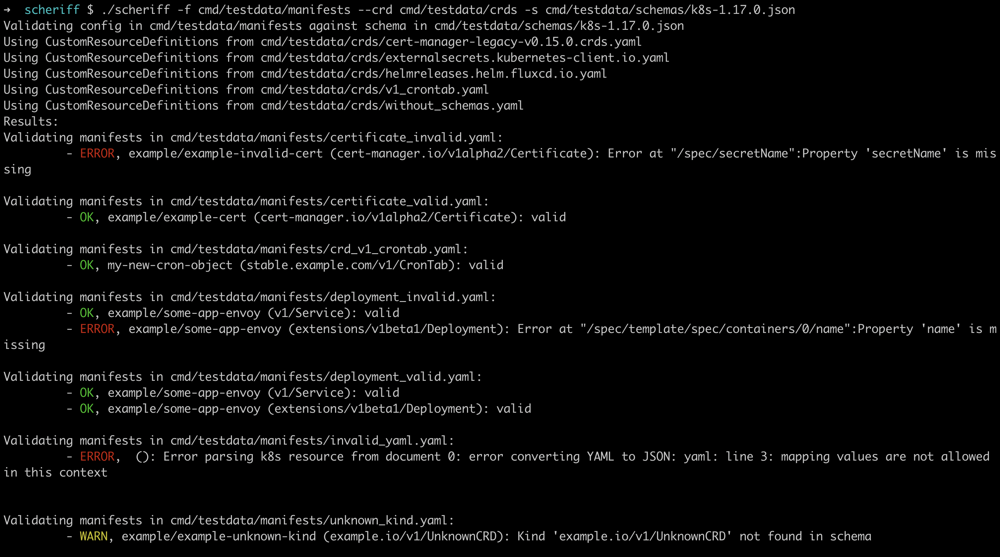

# Scheriff - Schema Sheriff

[](https://circleci.com/gh/fllaca/scheriff/tree/master)
[](https://codecov.io/gh/fllaca/scheriff)

Yet another Kubernetes manifests validation tool.

Schema Sheriff performs offline validation of Kubernetes configuration manifests by checking them against OpenApi schemas. No connectivity to the Kubernetes cluster is needed


## Rationale

Kubernetes configuration can become complex and hard to maintain in medium-big projects: it can be easy to make silly syntax mistakes when writing the specs of a new resource, and the way to check the config is valid is usually deploying it or running `kubectl apply --dry-run`, which both require an actual K8s cluster to do so. This gets even more complicated when using Custom Resource Definitions (CRDs) or when wanting to validate against multiple K8s versions.

_SchemaSheriff_ aims to tackle all this by validating your K8s configuration manifests against OpenAPI schemas, which can be easily downloaded from either the cluster itself or the public Kubernetes repository (see [Get the schemas](#get-the-schemas)). This validation can be performed 100% offline without needing a connection to any K8s cluster.


## Usage

_SchemaSheriff_ usage is really simple, just use the `-f` flag to specify the files or folders containing the K8s config files to be validated, and the `-s` flag to indicate the path to the OpenApi specs of the specific Kubernetes version to be validated against. The important thing then is getting the schemas:

## Get the schemas

There are several ways to obtain the Kubernetes OpenAPI schemas for validation, but mainly you can either ask for them to cluster directly, or download them from the Kubernetes public repository.

### Get the schemas from the Cluster

Just running this command you can obtain the K8s OpenAPI specs directly from your cluster:

```bash
kubectl get --raw /openapi/v2 > k8s-openapi-specs.json
```

Then you can use those specs to validate your config. Full example:

```bash
kubectl get --raw /openapi/v2 > k8s-openapi-specs.json

scheriff -s k8s-openapi-specs.json -f path/to/config/files
```


### Download the schemas from Kubernetes Repo

If you want to do "offline" validation (without connecting to any K8s cluster), the OpenApi specs of all versions of Kubernetes are publicly available at `https://raw.githubusercontent.com/kubernetes/kubernetes/v${KUBERNETES_VERSION}/api/openapi-spec/swagger.json` and can be downloaded direclty from there:


```bash
KUBERNETES_VERSION=1.17.0

curl -sL "https://raw.githubusercontent.com/kubernetes/kubernetes/v${KUBERNETES_VERSION}/api/openapi-spec/swagger.json" > k8s-$KUBERNETES_VERSION-openapi-specs.json

scheriff -s k8s-$KUBERNETES_VERSION-openapi-specs.json -f path/to/config/files
```


```
$> scheriff --help

Schema Sheriff: A Kubernetes manifests validator tool

Schema Sheriff performs offline validation of Kubernetes configuration manifests by checking them against OpenApi schemas. No connectivity to the Kubernetes cluster is needed

Usage:
  scheriff [flags]

Flags:
  -c, --crd stringArray        files or directories that contain CustomResourceDefinitions to be used for validation
  -f, --filename stringArray   (required) file or directories that contain the configuration to be validated
  -h, --help                   help for scheriff
  -R, --recursive              process the directory used in -f, --filename recursively. Useful when you want to manage related manifests organized within the same directory.
  -s, --schema string          (required) Kubernetes OpenAPI V2 schema to validate against
      --version                version for scheriff

```




## How it compares to other tools

* [Kubeval](https://github.com/instrumenta/kubeval/): _SchemaSheriff_ was inspired by this amazing project. Kubeval has a rich set of handy features (like automatic downloads of schemas), and also provides offline validation of Kubernetes configuration, but it doesn't support CRD validation. It also relies on some pre-generated JsonSchemas that are maintained in a third repository. _SchemaSheriff_ supports CRD validation using the `--crd` flag, and uses directly the OpenApi schemas offered directly by Kubernetes, without needing to transform them.
